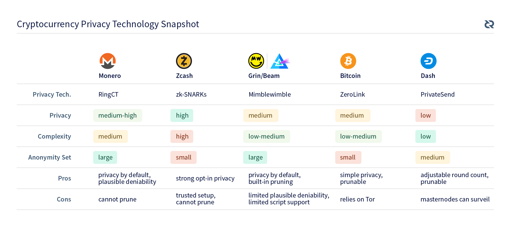

> In this article I will discuss my views on the existing privacy technology in use in the cryptocurrency space. Since several projects have a primary focus on privacy, I will explain the various privacy technologies, which will help in understanding the route Decred has taken and I will advocate we take. A second article will follow that goes into more detail on how Decred plans to approach privacy. The projects I will cover here are:

*   Monero
*   Zcash
*   Grin/Beam
*   Bitcoin
*   Dash

Note that I will only be discussing the on-chain privacy technologies used in each of these cases, not the entire project. At the end of the article, I have assembled a table comparing the various projects and technologies they use.

## Motivation

Decred has primarily focused on governance since its launch in February 2016, but after making substantial progress on the governance front, the time has come to begin adding privacy features. While privacy is certainly a separate subdomain from governance within the space, privacy connects very directly to the core tenets of Decred: Security, Adaptability, and Sustainability.

By giving our users added privacy, we enhance their and the project’s financial security. Additional privacy features can be added with the consent of our stakeholders in an incremental fashion, allowing Decred to adapt to a changing technological landscape as necessary. Giving our users privacy also makes the project substantially more resilient against malicious actors, magnifying its sustainability in the longer term.

## Context

All existing cryptocurrency privacy technology can be distilled down to “math tricks”. Less reductively, several subdomains of mathematics exist that are dedicated to understanding how to efficiently prove certain statements whilst obfuscating much of the data used to prove that statement. Several techniques from these subdomains have been carefully applied to blockchain technology to create the systems in production today. I will be discussing these techniques, their applications, their constraints, and their failure modes.

## Monero

Monero’s privacy makes use of a combination of technologies, ring signatures and confidential transactions, which they refer to as [RingCT](https://getmonero.org/resources/research-lab/pubs/MRL-0005.pdf). The combination of these techniques creates strong privacy guarantees, with some caveats. RingCT is required for all transactions on the Monero network.

### Ring Signatures

Ring signatures were the basis of the [CryptoNote protocol](https://cryptonote.org/whitepaper_v1.pdf) that spawned Bytecoin and Monero. The main utility of ring signatures is that they prevent passive adversaries from tracing the origin of transactions by creating plausible deniability about the unspent transaction outputs (“UTXOs”) used to fund the transaction, e.g. a typical transaction will show 11 sets of input UTXOs, but only one of those sets contains the real input UTXOs. Ring signatures allow an external observer to verify the signatures are from one of the sets of UTXOs, but not which set. Currently, Monero uses a multilayered linkable spontaneous anonymous group (“MLSAG”) signatures, and they will likely be updating this to a new more compact version, called [“CLSAG”](https://getmonero.org/resources/research-lab/pubs/MRL-0011.pdf), in the near future.

Ring signatures take a very narrow approach towards addressing the tracing of transactions on a blockchain. By obfuscating which inputs are used in a given transaction and the signature for those inputs, the ability to deterministically link transactions is broken. Ring signatures do exactly what they need to do and no more. The mathematics and code involved are of moderate complexity, using straightforward primitives and comprising a few thousand lines of source code. The size of the signatures scales linearly in the number of inputs for MLSAG signatures and logarithmically for CLSAG. Ring signatures, along with the rest of elliptic curve cryptography (“ECC”), depend on the discrete logarithm problem (“DLP”) being hard, i.e. unsolvable at the current time, and if DLP is broken, [ring signatures can be undone](https://monero.stackexchange.com/questions/2937/will-quantum-computer-break-ring-signatures) to reveal the actual sender. A notable drawback of ring signatures is that it is not possible to prune the blockchain or otherwise create a snapshot of the UTXO set because it is not possible to determine which transaction outputs are spent and which are not. This is reflected in [recent work](https://ww.getmonero.org/2019/02/01/pruning.html) to have each full node store only 1/8 of all historical transactions.

### Confidential Transactions

[Confidential transactions](https://people.xiph.org/~greg/confidential_values.txt) (“CT”) were proposed by Greg Maxwell as a method to obfuscate the amounts used in Bitcoin transactions. This is achieved by using Pedersen commitments, verifying the commitments sum to zero, and including range proofs that each output commitment corresponds to a positive amount. The range proofs are low-complexity zero knowledge proofs (“ZKP”). In the context of RingCT, an additional modification must be made to maintain untraceability for the sender, but this modification, which involves commitments summing to a non-zero scalar, is not relevant to understanding the properties of CT. Monero’s first implementation of CT was based on the original work by Maxwell, but they have recently deployed a significantly more efficient implementation, called [Bulletproofs](https://web.stanford.edu/~buenz/pubs/bulletproofs.pdf), proposed by Bünz et al. Use of Bulletproofs substantially reduces the size and improves the scaling of the range proofs.

CT is similar to ring signatures in that it is a narrow approach to addressing obfuscation of transaction amounts. When Monero was launched, it implemented the CryptoNote protocol, which did not include transaction amount obfuscation, so transactions had amounts with fixed denominations that could be analyzed by passive observers. CT added the amount obfuscation that Monero was missing, which substantially improved its privacy. Like ring signatures, the security of CT depends on DLP being hard, which is expected because it depends on ECC. Unlike ring signatures, [CT cannot be undone by breaking DLP](https://monero.stackexchange.com/questions/11213/what-is-the-impact-of-having-perfectly-hidden-but-only-computationally-bound-com/) because Pedersen commitments are a perfectly hiding and computationally binding scheme. The perfect hiding property means that a set of many points, an amount and a blinding factor in this case, map to the same commitment, so even if you can break DLP, you cannot determine which pair of points mapped to that commitment. Computationally binding indicates that an attacker who can break DLP can generate amounts and blinding factors that map to a given commitment, but that do not match the input amount and blinding factor. While perfectly hiding commitments are great for privacy, even in the case an attacker can break DLP, they are also necessarily risky because an attacker who can break DLP can create stealth inflation, due to the commitments being only computationally binding. The mathematics in the original CT proposal from Maxwell is of moderate complexity, but the more space-efficient Bulletproofs are of moderate-to-high complexity. The source code to implement Bulletproofs is a few thousand lines long, uses straightforward primitives, and synthesizes those primitives in a novel fashion.

## Zcash

Zcash’s privacy uses ZKPs to obfuscate both the sender and the amount for transactions. The specific type of ZKP used is a zero-knowledge succinct non-interactive argument of knowledge, called a zk-SNARK. This system guarantees substantial opacity, and requires users to opt-in to use it. There are both transparent and shielded transactions in the Zcash network, where shielded transactions are the ones that are protected by zk-SNARKs. As of Q2 2018, approximately [3.6% of all ZEC was stored in shielded addresses](https://arxiv.org/pdf/1805.03180.pdf).

### zk-SNARKs

The use of zk-SNARKs in a cryptocurrency context was proposed in the [Zerocash paper](http://zerocash-project.org/media/pdf/zerocash-extended-20140518.pdf) by Ben-Sasson et al in 2014, and that paper was the basis for Zcash. zk-SNARKs allow for the creation of succinct transactions that have their inputs, amounts and recipients completely obfuscated. The obfuscation of the transaction data is achieved by constructing arithmetic circuits that can be efficiently verified by 3rd parties without seeing the transaction data, and these circuits are the payloads of shielded transactions. Fully shielded transactions’ inputs are effectively indistinguishable from each other, meaning that the anonymity set for a particular transaction is the entire shielded segment of the UTXO set.

zk-SNARKs are an incredibly broad tool which can be brought to bear on a wide variety of problems, e.g. access control, voting systems, and generic record keeping. While zk-SNARKs are a very powerful tool that can applied in a wide variety of scenarios, they have a substantial cost in terms of complexity. The mathematics that support zk-SNARKs have a high complexity and require the use of less common primitives. In order to create a zk-SNARK in Zcash, one must take the transaction information and “compile” it into an arithmetic circuit, which is both computationally intensive and requires a few tens of thousands of lines of code. Beyond the amount of code being used to create the circuit, this code requires non-trivial amounts of domain knowledge to effectively audit. A more concrete constraint of zk-SNARKs is that they require a trusted setup phase to generate parameters for the network, and if the trusted setup phase information is compromised by a malicious actor, they can silently forge coins while leaving existing shielded transactions unaffected. [An attacker that can break DLP](https://z.cash/support/faq/) has a similar power to forge coins, but they can only view transaction amounts and memos, not the senders and receivers. Due to the opacity of shielded transactions, pruning can only work on the transparent segment of the Zcash chain.

## Grin/Beam

Grin and Beam both implement the system proposed in the [Mimblewimble (“MW”) paper](https://github.com/mimblewimble/docs/wiki/MimbleWimble-Origin) by Tom Elvis Jedusor in July 2016\. The MW approach to privacy is to restructure blockchain transactions such that they can be aggregated into blocks, obfuscating the senders and receivers within every block, where amounts are obfuscated using CT. MW privacy applies to all transactions.

### Transaction aggregation

The MW paper proposes restructuring blockchain transactions such that entire transactions can be directly combined. This ability to aggregate is based on substantially altering the way transactions are signed, then using the fact that signatures can be added together to get a valid signature on the aggregated transaction. Blocks mined using this system consist of a single large aggregated transaction, with its amounts obfuscated. Any adversary attempting to historically analyze such a blockchain would only be able to observe the large aggregated transactions that made up each block, which provide plausible deniability regarding senders and receivers.

Transaction aggregation makes use of a common ECC tool, [signature aggregation](https://bitcoincore.org/en/2017/03/23/schnorr-signature-aggregation/), in a novel way, so it is a broad tool being applied rather narrowly. The mathematics behind signature aggregation are very straightforward and used extensively with ring signatures and CT. The signature algorithm and code to aggregate transactions is a few thousand lines or less and uses common primitives. Despite the utility derived from transaction aggregation, the modifications to the signature algorithm, the inability to use transaction scripts, and changes to the transaction creation process are substantial, so they are unlikely to be integrated into other existing Bitcoin-based blockchains. Once blocks are mined, the included transactions have been aggregated, but prior to being mined, miners and other nodes on the network can see the individual transactions that have been published before they are aggregated. An adversary that closely monitors the transactions being published on the network could use that information to link transactions that cannot be linked by looking at mined blocks. Since MW uses CT directly, an attacker that breaks DLP could silently forge coins, but not undo previous aggregations or reveal amounts. An additional benefit of using MW is that it is built to prune very easily, substantially reducing the storage footprint of full nodes.

## Bitcoin

Bitcoin does not implement any substantive privacy features in Bitcoin Core beyond being able to manually select input UTXOs, but an alternative Bitcoin wallet, [Wasabi Wallet](https://www.wasabiwallet.io/), does implement privacy features. Wasabi Wallet makes use of a Chaumian CoinJoin process for privacy. Privacy with Bitcoin requires users to opt-in.

### Chaumian CoinJoin

Through the application of blind signatures, [Chaumian CoinJoin](https://github.com/nopara73/ZeroLink#ii-chaumian-coinjoin) creates plausible deniability regarding the ownership of mixed coins. The CoinJoin process involves a server merging several transactions into a single transaction, giving some on-chain privacy to the participants, but the server can see where funds originate and where they were sent. By using blind signatures, it is possible to obfuscate which outputs link to which set of inputs, preventing the server from linking inputs to outputs. This mixing process occurs episodically, triggered either by a timer or a participation threshold.

The use of [blind signatures](https://blog.cryptographyengineering.com/a-note-on-blind-signature-schemes/) for the CoinJoin process is a narrow application of a straightforward cryptographic technique. The mathematics behind blind signatures are both low complexity and well-studied, requiring a few hundred lines of code or less to implement. In order to ensure outputs are indistinguishable, several output denominations are used. Since amount obfuscation is not supported in Bitcoin, passive analysis can be used to link inputs and outputs via partial sums, which leads to the need to handle change carefully. The privacy gained from using the blind signature process depends on being able to connect to the server at least 3 times per mix via different network paths, which uses the integrated Tor support in Wasabi Wallet. While Tor provides a decent amount of network privacy, [Tor was not designed to thwart a global passive adversary](https://security.stackexchange.com/questions/48502/tor-traffic-correlation-attacks-by-global-adversaries), e.g. NSA, so the privacy gain is dependent on who your perceived adversaries are. An attacker that breaks DLP can impersonate the server, forge signed output addresses, steal input UTXOs, deanonymize mixes from the point they start their attack, and generally force the server to cease operation, but such an attacker cannot deanonymize prior mixes. Chaumian CoinJoin causes no problems with pruning.

## Dash

Dash implemented a privacy feature in their Dash Core Wallet, called [PrivateSend](https://github.com/dashpay/dash/wiki/Whitepaper), in 2014\. PrivateSend is a distributed CoinJoin process that uses multiple rounds of mixing. Privacy with Dash is an opt-in process.

### PrivateSend

The CoinJoin process has already been covered in the section about Bitcoin, but a similar process is used in Dash. The PrivateSend CoinJoin process involves masternodes merging several transactions into a single transaction, giving some on-chain privacy to the participants, but the masternode executing a given CoinJoin can see where funds originated and where they were sent. Users can specify 4-16 rounds of this mixing, to increase the size of their anonymity set.

PrivateSend is a less private version of Chaumian CoinJoin, albeit with additional rounds of mixing. Distributed CoinJoin is a very narrow tool, meant to obfuscate the origin of coins on-chain, but not obfuscate the senders and receivers from the masternodes that perform each CoinJoin. The algorithm for CoinJoin is straightforward, low complexity, and can be implemented in a few hundred lines of code. It is difficult to estimate how much anonymity is afforded by the PrivateSend process, as there have been claims made that a few large mix participants for this process could effectively deanonymize the CoinJoins. In the event that an attacker can break DLP, they can impersonate arbitrary masternodes, potentially deanonymizing CoinJoins from that point forward, but this would leave prior completed CoinJoins unaffected.

## Conclusion

Since it is easy to get lost in the details, a table comparing the privacy features of these projects is shown below. After covering privacy features of several other major cryptocurrency projects, you are now in a good position to understand Decred’s unique approach, which will be outlined in the next article.

